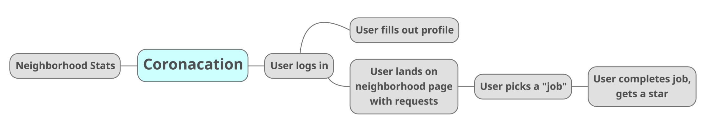

# Coronacation
VIVA CORONACATIONNNNN

## Objective
This app connects people in neighborhoods to each other based on their needs. If a user needs someone to grab prescriptions or groceries, they can ask fellow neighbors for assistance.

#### Josh: 
>We could start small by just having it for Austin, and having like neighborhoods within Austin. Like Hyde Park, West Campus, Rosedale, etc.
When a user wants to add a need, there's a form asking them what their need is and what neighborhood they are in. When they specify a neighborhood, we push the results to said neighborhood.
The user's request could be seen as a post on reddit, where individuals can respond to if they have something they can offer.
Maybe we could make it so that every user can be messaged. That way there's some sort of privacy for sharing information.
When the user's need is received, they can remove their request.
Maybe because there are a lot of people in the city, there should be a limit of 5 requests per user?
Every neighborhood can have it's own page.
The top post will be whatever is the most recent or maybe whatever has the most comments on it. Like a fire topic.

## Market Analysis
This area is dominated by [Nextdoor](https://nextdoor.com/), Facebook Groups, and smaller alternatives like [Rooster](https://therooster.co/).

### Technologies Used
MERN Stack
UIKit
Motion-X for animation
Requires a messaging/posting method in the app so users can pm sensitive data to each other.

#### Contributors 

Crystal Ly, Josh Kuruvilla, Kimi Inglet, Mags Kiefer, Z Naddaf, Brianna McCray, and Anthony Garza