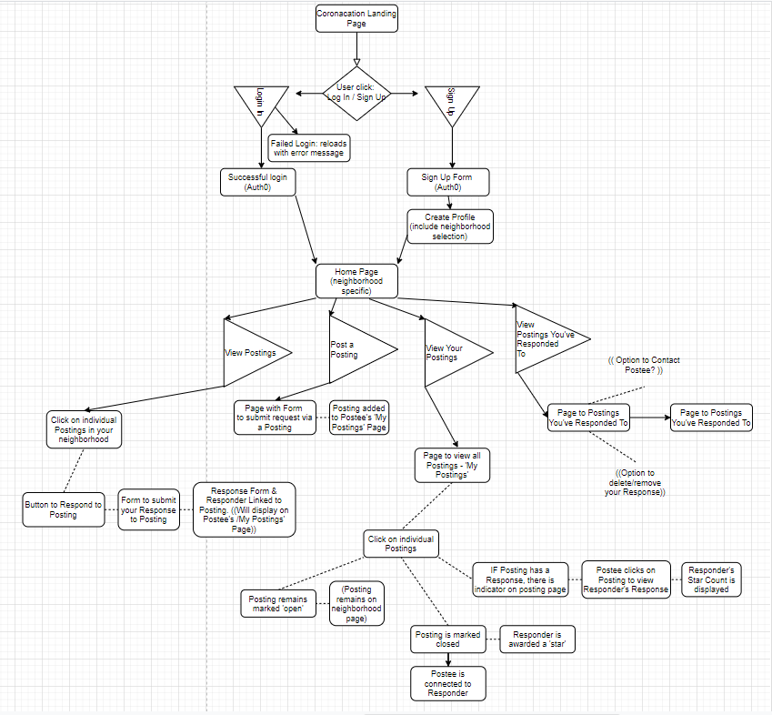

# Coronacation
VIVA CORONACATIONNNNN

## Objective
This app connects people in neighborhoods to each other based on their needs. If a user needs someone to grab prescriptions or groceries, they can ask fellow neighbors for assistance.

#### Application Functionality
When a user reaches the Landing Page at the root URL, the view information about the application, instructions about signing up, and links to Log in or Sign Up. 

The Log In Page features an email field, password field, submit button, and password assistance link. ((Icebox: Google/Facebook/Other connection login with Auth0))

The Sign Up Page features form to create account email and password, as well as radio dial preselections or a zipcode field for the user to select their Local Neighborhood. 

After Logging In, the User is redirected to the User Home Page. Features include: [1] Display of Neighborhood Postings ordered by Most Recent in section: 'My Neighborhood'. [2] Link to user's Postings in 'My Postings'. [3] Link to Postings User has Responded to in 'My Responses'. [4] Form to create a Posting in 'Create Posting'

When a user (Postee) needs something, they can post a Posting. On the Create Posting page, there's a form asking the User to define their need and a submit button. Once submitted, the Posting will be assigned a foreign key of the Neighborhood affiliated with the User's account. 

Limit of 5 Requests per User. Unlimited number of Responses. 
Ability to Flag Users abusing the system. Flagged User emails will be Blocked. 

## Market Analysis
This area is dominated by [Nextdoor](https://nextdoor.com/), Facebook Groups, and smaller alternatives like [Rooster](https://therooster.co/).

### Technologies Used
MERN Stack
UIKit
Motion-X for animation
React Toastify for notifications
Requires a messaging/posting method in the app so users can pm sensitive data to each other.

#### Contributors 

Crystal Ly, Josh Kuruvilla, Kimi Inglet, Mags Kiefer, Z Naddaf, Brianna McCray, and Anthony Garza