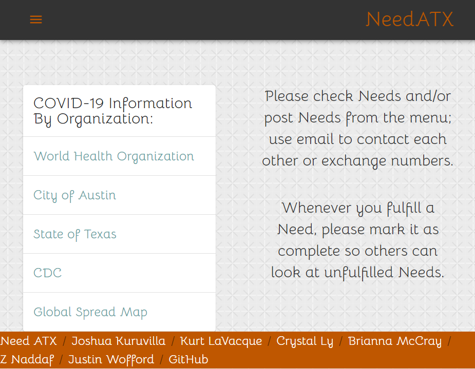
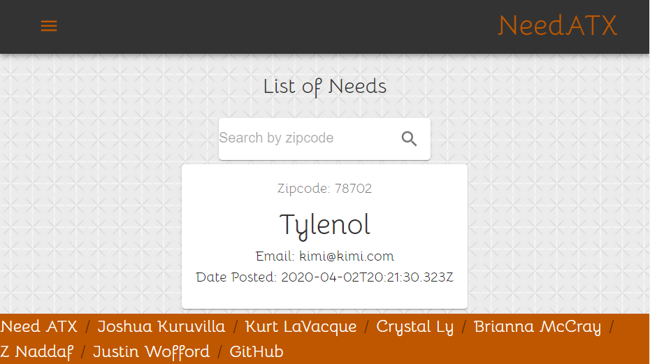
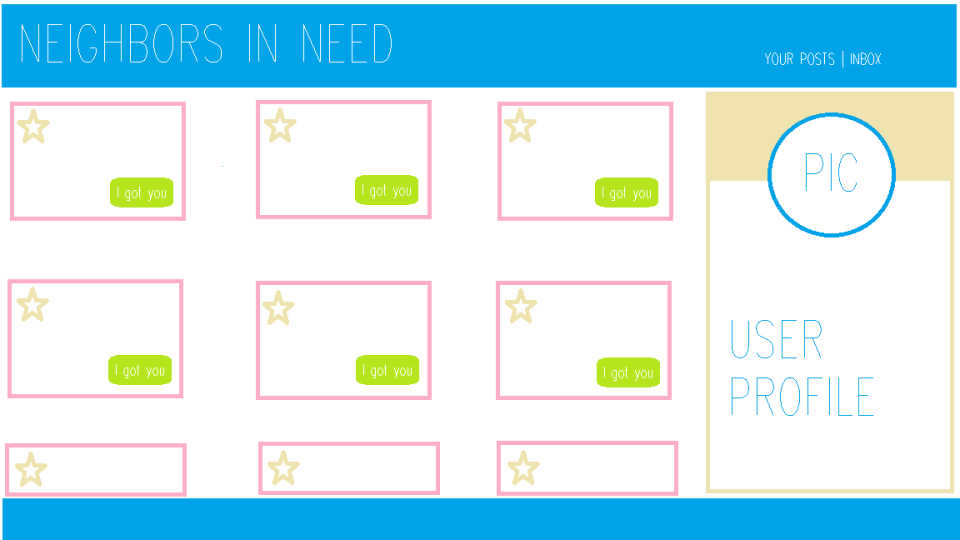
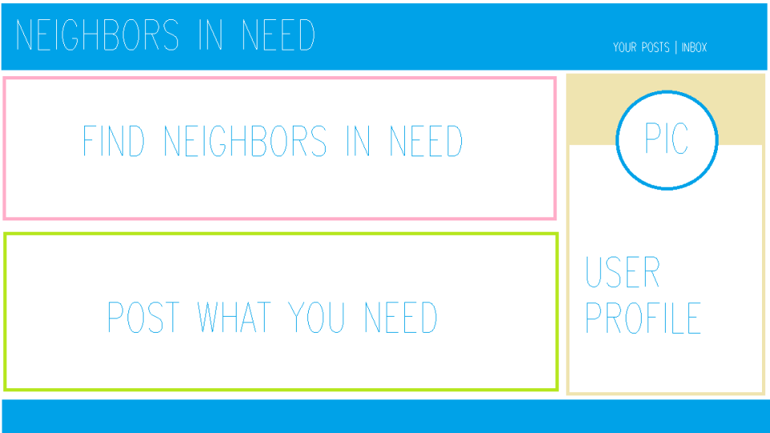
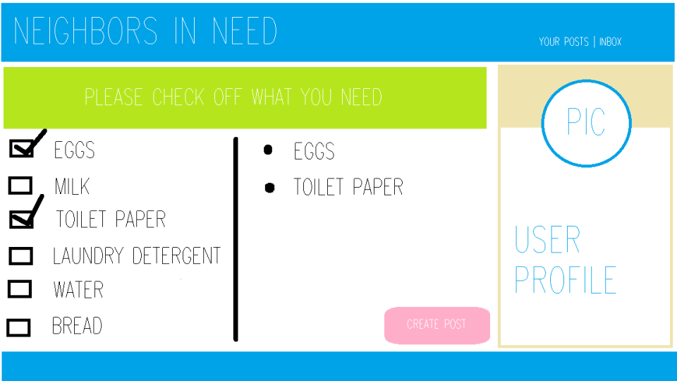
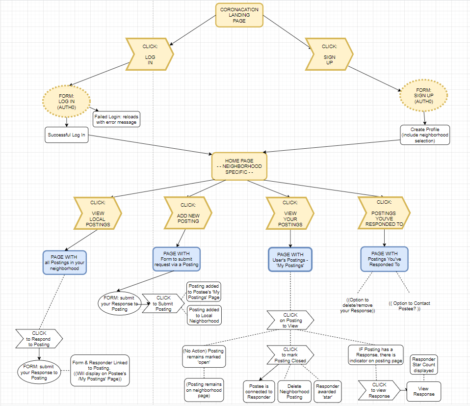
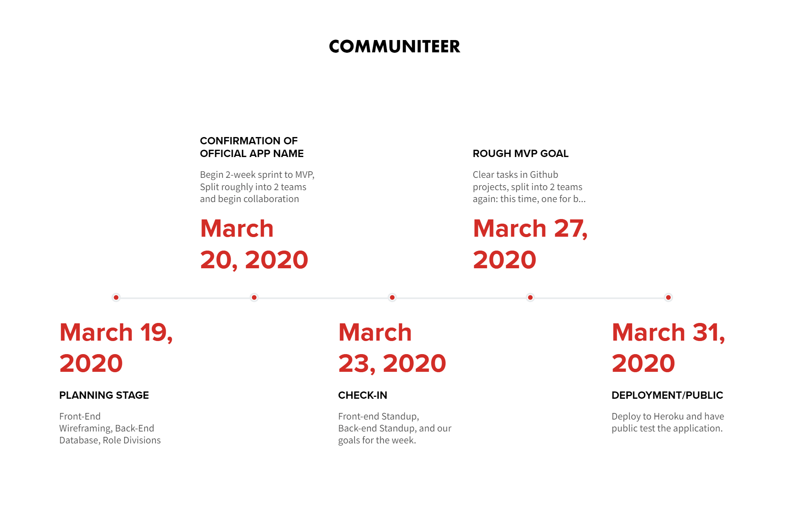

# Coronacation AKA Communiteer AKA Need

Follow our development [here](https://coronacation.herokuapp.com/).

## Objective

This app connects people in neighborhoods to each other based on their needs. If a user needs someone to grab prescriptions or groceries, they can ask fellow neighbors for assistance.

## User Story

As someone who cannot leave my home or neighborhood, there are things that I need that I can’t get, so I want to post the things I need.
As a person who has extra supplies (or access to extra supplies), I would like to help other people by donating the things I don’t need.

### Scope

Currently, we are restricting the location for this app to Austin, TX zipcodes. This is our initial test-run of this app.

> 78681 78701 78702 78703 78704 78705 78710 78712 78717 78719 78721 78722 78723 78724 78725 78726 78727 78728 78729 78730 78731 78732 78733 78734 78735 78736 78737 78738 78739 78741 78742 78744 78745 78746 78747 78748 78749 78750 78751 78752 78753 78754 78756 78757 78758 78759 78799

#### Application Functionality

When a user reaches the Landing Page at the root URL, they will view information about the application. 

The Log In Page features an email field, password field, submit button, and password assistance link. ((Icebox: Google/Facebook/Other connection login with Auth0))

(Icebox) The Sign Up Page features form to create account email and password, as well as radio dial preselections or a zipcode field for the user to select their Local Neighborhood. 

After the homepage, the User is redirected to a page with most recent Needs. Features include: 
[1] Display of Neighborhood Postings ordered by Most Recent. 
~~[2] Link to user's Postings in 'My Postings/User Profile'.~~ 
~~[3] Link to Postings User has Responded to in 'My Responses'.~~ [4] Form to create a Posting in 'Create Posting'.

When a user (Postee) needs something, they can post a Posting. On the Create Posting page, there's a form asking the User to define their need and a submit button. Once submitted, the Posting will be assigned a foreign key of the Neighborhood affiliated with the User's account. 

* Limit of 5 Requests per User?
* Unlimited number of Responses, due to direct messaging/emails. 
* Ability to Flag Users abusing the system. (Icebox)
* Flagged User emails will be Blocked. (Icebox)

---

## Market Analysis
This area is dominated by [Nextdoor](https://nextdoor.com/), Facebook Groups, Craigslist, and smaller alternatives like [Rooster](https://therooster.co/).

### Technologies Used
MERN Stack 
Mongoose 
UIKit  
SASS  
Motion-X for animation  
React Toastify for notifications  
- Requires a messaging/posting method in the app so users can pm sensitive data to each other.   

### Timeline

#### Contributors 

**Project Manager:** [Z Naddaf](https://github.com/N0matic)

**Back-End Developers:** [Kurt LaVacque](https://github.com/livingkurt), [Crystal Ly](https://github.com/cml2377), [Josh Kuruvilla](https://github.com/joshkuruvilla512), [Justin Wofford](https://github.com/JayDub21)

**Front-End Developers:** [Brianna McCray](https://github.com/bwmccray), [Justin Wofford](https://github.com/JayDub21), [Crystal Ly](https://github.com/cml2377) 

**QA/Advisors/Coding Gods:** [Israel Medina](https://github.com/medinaisrael-17), and [Anthony Garza](https://github.com/anthonyagarza)
